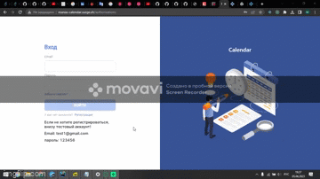

 

# Calendar:

Make an MVP for internal communication and organizing meetings of megacom employees

## Features:
* The project is written in TypeScript with the help of React using state. Redux manager.
* The project implements registration and authorization, as well as validation forms with React-hook-form and React-select.
* The main calendar can be displayed in several formats: day, week, month.
* The application can be created, edited and deleted various events, as well as labels for these events and search by him. It is also possible to look at the calendars of others users.

## Technologies: 
React, Redux, Ant Design, Firebase, React-hook-form, React-router-dom, React- select,Moment.

# How to run this app:

1. Clone this repository
2. Install all necessary dependencies via npm i
3. Start the app via npm start
